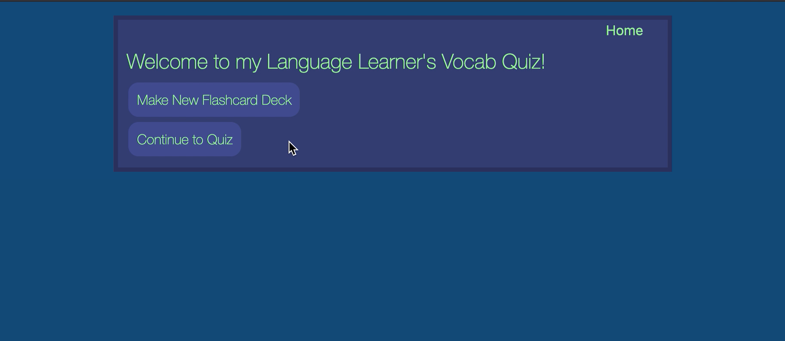
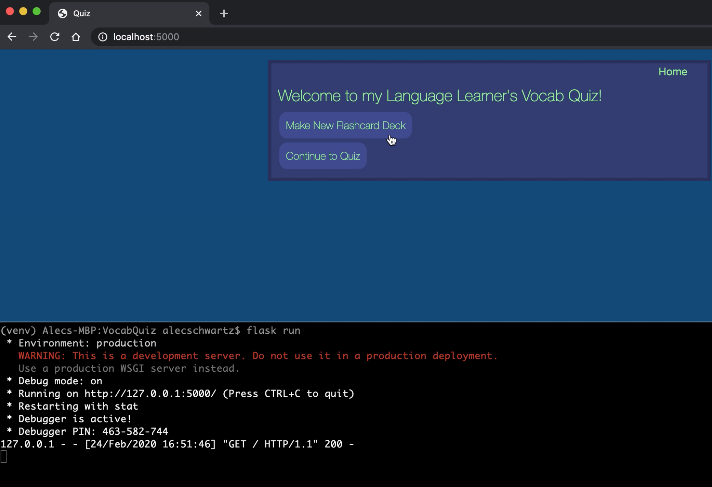

Language Learner's Vocab Quiz
--------------------------
This web application uses a Python-Flask framework to create a vocabulary quiz for users. It works with JSON representations of vocabulary files which can be created in the app.

### Table of Contents
1. [Overview](#overview)
2. [Walkthrough](#walkthrough)
3. [How to run it](#howtorunit)
4. [How it works](#howitworks)

### Overview 

This app guides a user to create or select existing flashcard decks that they can use in a simple quiz. The quiz is structured to show user a term, have them provide the definition, and tell them if they are correct before proceeding to the next term. This quiz can be played using both localhost and Terminal.

### Walkthrough 

Click the image for a link to a video walkthrough of the application.

Click here for a walkthrough showing Terminal use.

### How to run it 

1) [Install Python 3](https://www.python.org/downloads/)
2) [Install Flask](https://flask.palletsprojects.com/en/1.1.x/installation/#install-flask)
3) [Clone/download this repository](https://help.github.com/en/github/creating-cloning-and-archiving-repositories/cloning-a-repository)
4) In Terminal change directory to /VocabQuiz
5) To play the game in Terminal, type this into the command line:
   $ python quizFunctions.py
6) To play the game using the GUI, activate the Flask virtual environment and run Flask:
   $ cd venv
   $ source bin/activate
   $ cd ..
   $ flask run
7) Open web browser and type this into address bar: http://localhost:5000/
8) To stop running the game:
   $ ctrl + c
   $ deactivate (deactivates virtual environment)

### How it works 

The application is made up of the following files:

1) __init__.py - imports Flask, creates app instance, then imports routes from routes.py.
2) routes.py - contains all route decorators, imports Python functions from quizFunctions.py, and uses request methods to show and submit client-server data.
3) base.html - this is the base template that extends across all templates to keep the style uniform.
4) style.css - contains custom CSS for the template.
5) HTML templates
